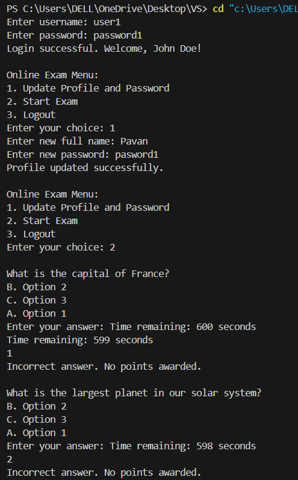

# Online Exam System

Welcome to the Online Exam System repository! This system provides a platform for conducting online exams with features for user authentication, exam setup, timer management, question presentation, and answer evaluation.

## Features

- **User Authentication**: Users can log in with their username and password to access the system.
- **Profile Management**: Users can update their profile information and password.
- **Exam Setup**: The system allows setting up exams with predefined questions and options.
- **Timer Management**: Each exam has a timer to limit the duration of the exam.
- **Question Presentation**: Questions are presented one by one to the user during the exam.
- **Answer Evaluation**: User answers are evaluated against the correct answers, and scores are calculated accordingly.

## How to Use

1. **Clone the Repository**: Clone this repository to your local machine using the following command:
2. **Compile the Code**: Compile the Java source files using the Java compiler:
3. **Run the Application**: Run the compiled application using the Java Virtual Machine:

## Technology Used

- **Java**: The core programming language used for developing the system.
- **HashMap and Map**: Used for storing and managing user information, questions, and options.
- **Scanner**: Utilized for user input handling.
- **Timer and TimerTask**: Employed for managing exam duration.
- **Object-Oriented Programming (OOP)**: Implemented to organize code into classes and objects.
- **Git**: Version control system used for collaboration and code management.

## Output

